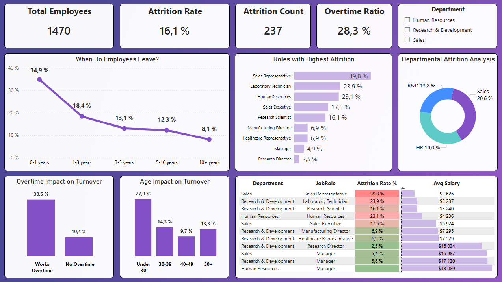
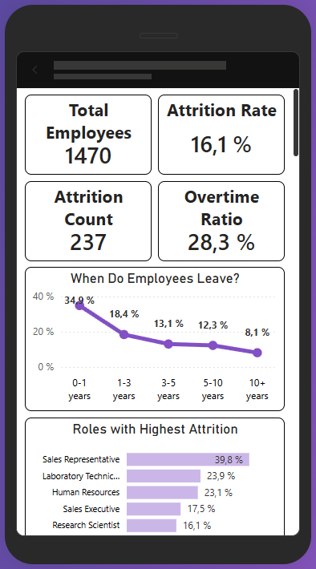

# 📊 HR Analytics: Employee Attrition & Retention Dashboard (Power BI)

---

## 📌 Project Overview

This project delivers an **executive-level Power BI dashboard** designed to analyze employee attrition patterns and uncover the **structural drivers of workforce turnover**.

Rather than presenting a simple turnover summary, the solution provides a **decision-ready view of organizational stability**, enabling multidimensional analysis across:

- Demographic factors  
- Behavioral indicators  
- Role-based risk concentration  

The objective is not only to measure attrition, but to:

- Identify risk concentration areas  
- Detect vulnerable employee segments  
- Highlight systemic retention challenges  

The dashboard integrates:

- Structured data modeling  
- Advanced DAX calculations  
- Executive-oriented UX design  

➜ Enabling fast, data-driven HR decision-making.

---

## 🎯 Business Challenge

**How can leadership proactively identify high-risk employee segments before turnover impacts organizational performance?**

The transformation required is shifting from:

- ❌ Descriptive reporting  
  *“How many employees left?”*

to

- ✅ Diagnostic insight  
  *“Why are they leaving, and where is the risk concentrated?”*

Decision-makers must determine whether attrition is structurally driven by:

- Workload imbalance (overtime exposure)  
- Critical tenure milestones (first-year vulnerability)  
- Role-specific volatility (customer-facing functions)  
- Demographic patterns (early-career retention challenges)  

➜ The objective is to convert attrition monitoring into a **forward-looking risk assessment tool**, rather than a retrospective KPI report.

---

## 🛠 Technical Stack

- Power BI  
- Power Query (Data cleaning & schema optimization)  
- DAX (Custom attrition & ratio calculations)  
- Structured analytical modeling with segmentation logic  
- Feature Engineering & analytical segmentation  
  *(Custom bucketing: Age & Tenure | Department label optimization)*  

---

## 🖥️ Dashboard Preview

### Desktop Version

> [!TIP]  
> Interactive tooltips enable granular data exploration.



---

### Mobile Optimization

> [!IMPORTANT]  
> Fully responsive layout designed for executive-level monitoring on smartphones.



---

## 🔍 Key Insights (Executive Analysis)

Based on the multidimensional analysis of **1,470 employees**, attrition is not evenly distributed, it is structurally concentrated in specific workforce segments.


###  1️⃣ Early-Tenure Structural Risk

The **first year of employment** represents a critical vulnerability point:

- 📉 Attrition Rate: **34.9%**
- Clear stabilization effect as tenure increases  

Potential drivers include:

- Onboarding structure  
- Early engagement strategy  
- Role expectation alignment  

➜ Early-tenure integration emerges as a high-impact retention lever.


###  2️⃣ Overtime as a Major Risk Multiplier

Attrition gap:

- With overtime: **30.5%**
- Without overtime: **10.4%**

This nearly **3× increase** strongly suggests workload imbalance as a structural pressure factor.

➜ Workload exposure appears to be a systemic turnover driver.


###  3️⃣ Role-Level Volatility

Attrition is concentrated in operational and customer-facing roles:

- **Sales Representatives:** 39.8%  
- **Laboratory Technicians:** 23.9%  

Potential structural exposure factors:

- Performance pressure  
- Career mobility  
- Compensation dynamics  

➜ Risk is unevenly distributed across departments.


###  4️⃣ Early-Career Talent Retention Challenge

Employees under 30:

- Attrition Rate: **27.9%**
- Significantly higher than older cohorts  

➜ Indicates generational retention dynamics requiring targeted development strategies.


###  5️⃣ Compensation & Risk Concentration

High-volatility roles also show lower average monthly salaries:

- ~$2.6k–$3.2k  

While causality cannot be inferred, this alignment suggests compensation sensitivity within high-risk segments.

---

## 💡 Strategic Implications

Although causality is not directly established, the structural patterns highlight actionable retention levers.


### 🔹 Strengthen Early-Tenure Integration

- Attrition peak: **34.9% in Year 1**
- Priority focus: onboarding & expectation alignment  
- Potential solution: structured mentorship programs  


### 🔹 Monitor Workload Imbalance

- Attrition gap: **30.5% vs. 10.4%**
- Risk driver: overtime exposure  

Workforce planning adjustments may reduce burnout-driven turnover.


### 🔹 Reassess High-Volatility Roles

Sales Representatives and Laboratory Technicians combine:

- High attrition  
- Lower average compensation  

Targeted benchmarking and clearer career pathways may improve stability.


### 🔹 Invest in Early-Career Retention

Elevated attrition among employees under 30 suggests:

- Generational retention dynamics  
- Need for structured career progression  

Internal mobility and development programs could mitigate this imbalance.

---

## 🚀 Technical Highlights


### 🔹 Context-Aware Ratio Calculations

Key structural indicators such as **Overtime Ratio %** were implemented using controlled filter context logic:

- Explicit row filtering inside `CALCULATE`  
- Safe division using `DIVIDE`  
- Reuse of base measures (e.g., `Total Employees`)  

➜ Ensures dynamic recomputation across Department, Age Group, and Tenure Group while preventing division errors.


### 🔹 Structured Workforce Segmentation (Custom DAX Logic)

Raw numerical fields were transformed into analytically meaningful segments using conditional logic (`SWITCH(TRUE())`).

#### Age Segmentation

- Under 30  
- 30–39  
- 40–49  
- 50+  

#### Tenure Segmentation

- 0–1 years  
- 1–3 years  
- 3–5 years  
- 5–10 years  
- 10+ years  

➜ Directly revealed the **34.9% attrition spike** within the first year.


### 🔹 Controlled Visual Ordering (Sort Columns)

Custom numeric sort columns override alphabetical behavior:

- Under 30 → 1  
- 30–39 → 2  
- 40–49 → 3  
- 50+ → 4  

➜ Reinforces analytical clarity in visuals.


### 🔹 Clean Measure Architecture

All KPIs are centralized in a dedicated `_Measures` table, ensuring:

- Logical separation between data and calculations  
- Reusable metric definitions  
- Simplified model navigation  

➜ Measures were optimized to avoid repeated context transitions and ensure model performance.


### 🔹 Executive-Oriented UX

- Clear information hierarchy  
- High signal-to-noise ratio  
- Fast insight consumption 

---

## 🧠 Technical Deep Dive: DAX Logic

To demonstrate the analytical and modeling logic behind the dashboard, below are selected DAX implementations illustrating segmentation design, filter context control, and ratio computation robustness.


1️⃣ Context-Controlled Ratio Calculation

One of the key metrics in the dashboard is the Overtime Ratio %, which dynamically evaluates the proportion of employees exposed to overtime under any filter context.

```dax
Overtime Ratio % = 
DIVIDE(
    CALCULATE(
        COUNTROWS(Fact_Employees),
        Fact_Employees[OverTime] = "Yes"
    ),
    [Total Employees]
)

```

Why this matters:

CALCULATE explicitly modifies the filter context.

The measure remains dynamic across all slicers.

DIVIDE prevents division-by-zero errors.

The denominator reuses a base measure for consistency.

This ensures reliable comparative analysis across departments, tenure groups, and demographic segments.


2️⃣ Analytical Segmentation Using SWITCH(TRUE())

To transform raw numeric data into meaningful analytical categories, conditional logic was implemented.

Age Grouping:

```dax
Age Group = 
SWITCH(
    TRUE(),
    Fact_Employees[Age] < 30, "Under 30",
    Fact_Employees[Age] < 40, "30-39",
    Fact_Employees[Age] < 50, "40-49",
    "50+"
)

```

Why this matters:

Converts continuous variables into strategic business segments.

Enables risk concentration analysis.

Improves executive readability compared to raw distributions.


3️⃣ Controlled Sorting Logic

To prevent misleading alphabetical ordering in visuals, a dedicated numeric sort column was created:

```dax
Age Group Sort = 
SWITCH(
    TRUE(),
    Fact_Employees[Age] < 30, 1,
    Fact_Employees[Age] < 40, 2,
    Fact_Employees[Age] < 50, 3,
    4
)

```

This ensures logical visual progression (Under 30 → 30–39 → 40–49 → 50+), reinforcing analytical clarity.

---

## 📈 Business Impact

- Immediate identification of high-risk employee segments  
- Clear evidence of overtime as a structural turnover driver  
- Early-tenure vulnerability detection  
- Role-based risk concentration analysis  
- Data-driven HR strategy support (retention, workload balancing, onboarding improvement)  

➜ The dashboard shifts attrition analysis from reactive reporting to proactive risk monitoring.

---

## 💾 Data Source

The analysis is based on the IBM HR Analytics Employee Attrition & Performance dataset, a structured HR dataset commonly used for workforce analytics and predictive modeling demonstrations.

---

## 📁 Project Architecture

The repository is structured to clearly separate assets, documentation, and analytical development files.

- **assets/** → Dashboard screenshots  
- **docs/** → Business documentation and analytical notes  
- **pbix/** → Power BI development file

---

## 👤 Author

**Emmanuel Chevalier**  
Data Analyst | Power BI & Business Analytics | Microsoft Power BI Data Analyst Professional Certificate
